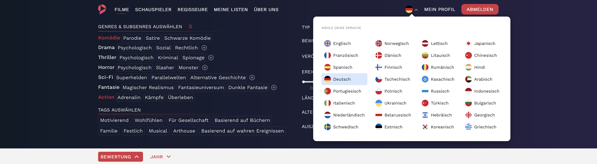

# nextjs-client

## Introduction

This repository contains demonstration-only code for my personal project https://FilmAdvise.com, a Next.js based application designed for the unique purpose of selecting movies and series. Please note that this is incomplete code and is intended for demonstration purposes only. It cannot be run as a fully functional application without further development.

## About the Project

FilmAdvise is created to help users find the perfect movie or series through a unique selection process. Our platform allows users to explore cinematic works based on detailed criteria such as genres, subgenres, tags, ratings, release years, and more. FilmAdvise does not host movies directly but provides comprehensive tools to discover and select films to watch on other platforms or cinemas.

## Key Technologies

- **Next.js**: A React framework for building user interfaces with server-side rendering and static site generation capabilities.
- **TypeScript**: Utilized for strong typing, enhancing code reliability and maintainability.
- **Next-Intl**: Provides built-in internationalization and localization support to cater to a global audience.
- **@Reduxjs/Toolkit**: State management library to manage the application state across the platform.
- **Material Symbols**: Used for integrating responsive and accessible icons and symbols.

## Screenshots

Below are some screenshots showcasing the functionality of the application. These images can be found in the `./screenshot` folder.

*Figure 1: Main page showing personalized movie recommendations.*

*Figure 2: Profile page for actors showing detailed information and related cinematic works.*

*Figure 3: Block for selecting the application's display language, demonstrating the site's localization features.*

## Disclaimer

This code is provided as a demonstration of what can be achieved with Next.js and is not intended for direct use in production environments. It is incomplete and is provided for educational and demonstration purposes only.
